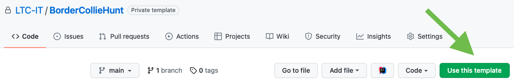

# Border Collie Hunt
## Purpose

This project is to be used as the starting point for the development of the working Border Collie Hunt game, where the player must round-up the errant Sheep.

## Task

Complete the various sections of the game as you develop your tutorial.

# How to start

Make you're logged into GitHub under your account. 

Click the Green "Use this template" button. This will copy the entire website and make your own version of the repository.

